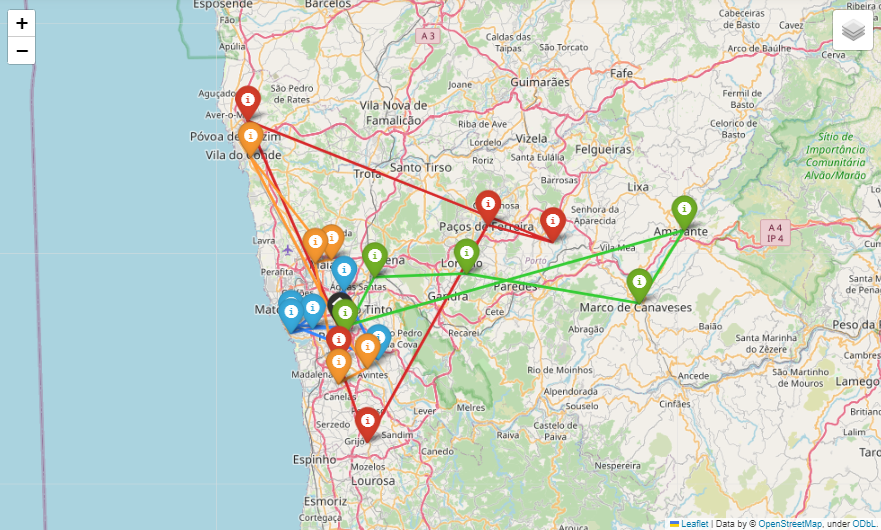

# Optimal-Inspection-Routes-ASAE-Use-Case
Deployed several meta-heuristics with informed search methods to solve a Vehicle Routing Problem in an use case of the specialized authority responsible for food safety and economic surveillance in Portugal, ASAE (Food and Economic Security Authority in english).

Simulated Annealing, Tabu Search and Genetic Algorithm were used to find the optimal distribution of establishments per route, while greedy-search and the A* algorithm were used in the objective functions to optimally (A* only) order the establishments in each route.

The main problem was to optimize the total travel time, that includes travel time, inspection times and waiting times (each establishment has a schedule), and that was the focus of the project for the Aitificial Intelligence course. However, the most interesting problem is the seconds, where we want to minimize the number of vehicles used, while we optimize routes and distribution of establishments per route, considering an 8 working hour limit time per brigade in each route.

The report only focuses in the results of the first problem has the other problems are adjustments of the first one.

